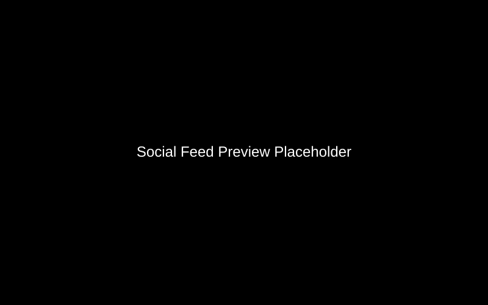

# AI Cyberbullying Social App - Web UI (Next.js)


A modern, responsive social media web application that leverages AI to create a safer online environment. Built with Next.js 15 and TypeScript, it provides a seamless user experience with real-time cyberbullying detection and interactive safety tools.

## 🔗 Connected Repositories
- **Backend (Django API)**: [AI-CyberBulling-Social-App-Backend-Django](https://github.com/Rilan-Dev/AI-CyberBulling-Social-App-Backend-Django.git)

## 🚀 Features

- **🛡️ Real-time Protection**: Instant feedback on post content using backend-integrated AI models.
- **📱 Responsive Design**: Fully optimized for mobile, tablet, and desktop viewing.
- **🌍 Deployment Ready**: Detailed [Deployment Guide](DEPLOYMENT.md) for various environments.
- **📊 Analytics Dashboard**: Comprehensive view of post status, safety metrics, and platform activity.
- **🔍 Content Analysis Tools**: Dedicated pages for testing raw text and images against the cyberbullying detection engine.
- **👤 Dynamic Profiles**: Customizable user profiles with post history and social interactions.
- **🌓 Dark/Light Mode**: Full theme support for comfortable viewing in any environment.
- **🛠️ API Integration Tools**: Built-in API testing and documentation viewer for developers.

## 🧠 AI-Driven User Workflow

The Frontend seamlessly integrates AI detection into the user experience to promote platform safety.

### 🛡️ Real-time Content Guard
- **Automatic Analysis**: When creating a new post, the application automatically sends text and images to the AI backend for a safety check.
- **Instant Moderation Labels**: Posts are immediately tagged with **"Clean"**, **"Flagged"**, or **"Blocked"** badges based on the AI's confidence score and reasoning.
- **Moderation Transparency**: Users are notified of the specific reason (e.g., "Age-based discrimination") if their content is flagged.

### 🧪 Interactive AI Sandbox
- **Text Analysis**: A dedicated page where users can input raw text to see the AI's prediction and confidence percentage.
- **Image Analysis**: A specialized uploader for scanning images for humor, negative sentiment, or NSFW content.
- **Developer API Docs**: An integrated documentation viewer that allows developers to test the AI endpoints directly from the UI.

### 📊 Safety Analytics
- **Visual Insights**: The dashboard uses **Recharts** to visualize platform-wide safety trends and user-specific moderation history.
- **History Tracking**: Dedicated views for reviewing previous text and image analysis results.

## 📸 Key Features Showcase

### 📱 Modern Social Feed
A clean, desktop-optimized feed where users can interact with content safely.

- **Status Badges**: Real-time "Clean" or "Flagged" indicators.
- **Social Interaction**: Seamless liking and commenting system.

### 📊 Analytics Dashboard
Comprehensive insights into platform safety and user engagement.

- **Safety Metrics**: Visual distribution of clean vs. flagged content.
- **Activity Trends**: Real-time charts of user interactions.

### 🛡️ AI Analysis Sandbox
Testing tools for proactive content moderation.

- **Multi-modal**: Support for both text and image analysis.
- **Confidence Scores**: Detailed breakdown of AI detection results.

## 🛠️ Technical Stack

- **Framework**: Next.js 15 (App Router)
- **Library**: React 19
- **Language**: TypeScript
- **Styling**: Tailwind CSS & Framer Motion
- **UI Components**: Shadcn UI (Radix UI)
- **Form Handling**: React Hook Form & Zod
- **API Client**: Axios with custom interceptors for JWT management
- **Data Visualization**: Recharts

## 📂 Project Structure

```
AI-CyberBulling-Social-App-Web-UI/
├── app/                    # Next.js App Router (pages, layouts, globals)
├── components/             # Reusable UI components (shadcn/ui + custom)
├── context/                # React Context providers (Auth, Post)
├── hooks/                  # Custom React hooks
├── lib/                    # Utility functions and API clients
├── Model/                  # TypeScript interfaces/types
├── services/               # API service layer for backend communication
└── public/                 # Static assets (images, icons)
```

## 📥 Installation

1. **Clone the repository**:
   ```bash
   git clone https://github.com/Rilan-Dev/AI-CyberBulling-Social-App-Web-UI.git
   cd AI-CyberBulling-Social-App-Web-UI
   ```

2. **Install dependencies**:
   ```bash
   npm install
   # or
   pnpm install
   ```

3. **Environment Setup**:
   Create a `.env.local` file in the root directory and add your backend API URL:
   ```env
   NEXT_PUBLIC_API_URL=https://ai-cyberbulling-social-app-backend-django-production.up.railway.app/api
   ```

4. **Start the development server**:
   ```bash
   npm run dev
   ```

5. **Build for production**:
   ```bash
   npm run build
   npm start
   ```

## 🔌 API Integration

The frontend communicates with the Django backend using a centralized `APIService`. It handles:
- **JWT Persistence**: Automatic attachment of Bearer tokens to requests.
- **Error Handling**: Standardized response processing and user notifications.
- **Mock Support**: Built-in mock API for development without a running backend.

## 🤝 Contribution

Contributions are welcome! Please follow these steps:
1. Fork the project.
2. Create your feature branch (`git checkout -b feature/AmazingFeature`).
3. Commit your changes (`git commit -m 'Add some AmazingFeature'`).
4. Push to the branch (`git push origin feature/AmazingFeature`).
5. Open a Pull Request.

## 📄 License

Distributed under the MIT License. See `LICENSE` for more information.

---
*Built with ❤️ to foster a safer digital world.*
